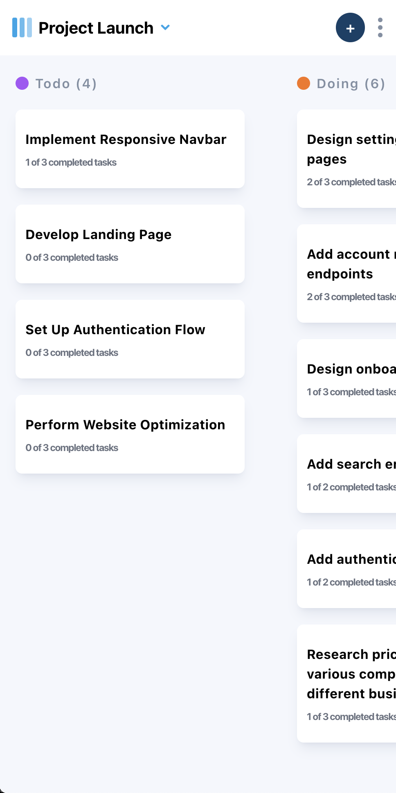

# Task Management App
A responsive and user-friendly Task Management application built with React.js and Tailwind CSS. This project helps users efficiently organize, track, and manage their tasks with features like adding, editing, and marking tasks as complete.

demo: 

## Features
- Add New Tasks: Quickly add tasks with descriptions and statuses.
- Edit Tasks: Modify task details, including title, description, and status.
- Subtasks: Manage subtasks to break down larger tasks into smaller components.
- Responsive Design: Optimized for all devices with a fully responsive layout.
- Dark and Light Modes: Easily switch between themes for a better user experience.
- Drag and Drop: Rearrange tasks effortlessly (if implemented).

## Screenshots

 

## Available Scripts
source code: https://github.com/david-tejada/fem-kanban-task-management
In the project directory, you can run:

### `npm start`

Runs the app in the development mode.\
Open [http://localhost:3000](http://localhost:3000) to view it in your browser.

The page will reload when you make changes.\
You may also see any lint errors in the console.

### `npm test`

Launches the test runner in the interactive watch mode.\
See the section about [running tests](https://facebook.github.io/create-react-app/docs/running-tests) for more information.

### `npm run build`

Builds the app for production to the `build` folder.\
It correctly bundles React in production mode and optimizes the build for the best performance.

The build is minified and the filenames include the hashes.\
Your app is ready to be deployed!

See the section about [deployment](https://facebook.github.io/create-react-app/docs/deployment) for more information.